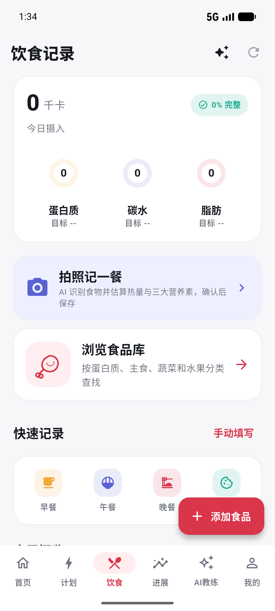

# NxtRep

面向个人训练与饮食管理的 AI 辅助 App。Flutter 客户端负责清晰、可执行的日常流程；FastAPI 后端管理训练、营养、身体数据和一个具备工具调用能力的教练 Agent。项目仍在开发中，当前用于展示完整的产品与工程实现，不是已上线的医疗或营养服务。



## 已实现的核心流程

| 领域 | 当前能力 |
| --- | --- |
| 训练 | 按目标、器械与训练频率浏览和预览计划；日历安排、训练中记录和进展回顾；动作库支持多种器械。 |
| 饮食 | 食品库、餐次记录、每日营养汇总；餐食照片识别后展示热量与三大营养素估算，用户核对或修改后保存。 |
| 身体进展 | 体重与围度记录、趋势；按美军围度法计算体脂估算值及范围，并与手填数据区分。 |
| AI 教练 | 流式对话、图片输入、上下文与长期记忆；训练计划等重要写操作先生成草稿，等待用户确认。 |
| 主动服务 | 可选择开启的独立 worker 检查训练与饮食记录缺口，并生成建议；没有记录不等于没有训练或进食。 |

这些能力依赖不同的环境配置：普通业务接口需要 PostgreSQL；照片上传/识别需要对象存储和视觉模型。缺少外部配置时，相关能力会明确失败，不使用伪造结果。

## 工程设计

```text
Flutter App
  ├─ 训练 / 饮食 / 进展 / AI 教练
  └─ 安全令牌存储、图片处理、SSE 流式消费
           │ HTTPS / JSON / SSE
FastAPI 模块化单体
  ├─ Router → Schema → Service → Repository
  ├─ LangGraph Agent → 业务服务 / 确认流程 / RAG
  ├─ PostgreSQL + pgvector / Alembic
  ├─ 私有对象存储（用户照片）
  └─ 独立主动教练 worker（与 API 共用业务代码）
```

重要取舍：用户数据按账号隔离；可重试的创建请求使用幂等键，编辑使用版本检查；Agent 不直接替用户执行高影响修改；照片营养和围度体脂都标为估算，要求用户复核。设计细节见[架构说明](docs/ARCHITECTURE.md)、[Agent 接口设计](docs/AGENT_INTERFACE_SPEC.md)和[移动端 API 契约](docs/MOBILE_API_CONTRACT.md)。

## 本地运行

需要 Flutter、Python 3.12+、PostgreSQL 与 pgvector。Android 模拟器可在 Windows 上验证客户端；iOS 构建需要 macOS。

1. 复制 `backend/.env.example` 为 `backend/.env`，填写本地数据库连接和随机 JWT 密钥。模型与对象存储密钥仅在测试相应能力时配置；不要提交真实 `.env`。
2. 在 `backend/` 执行：

   ```bash
   uv sync --extra dev
   uv run alembic upgrade head
   uv run uvicorn nxtrep_backend.main:app --app-dir src --host 0.0.0.0 --port 8000
   ```

3. 在 `frontend/` 执行：

   ```bash
   flutter pub get
   flutter run -d emulator-5554
   ```

Android 模拟器默认访问 `http://10.0.2.2:8000/api/v1`。连接真机或构建发布版时，请通过 `--dart-define=API_BASE_URL=https://.../api/v1` 指定可访问的 HTTPS API。更详细的环境与测试步骤在 [backend/README.md](backend/README.md) 和 [frontend/README.md](frontend/README.md)。

## 验证与当前边界

```bash
cd backend && uv run pytest -q
cd frontend && flutter analyze && flutter test
```

仓库包含后端单元/接口/数据库集成测试，以及 Flutter 单元、Widget 和 Android 模拟器回归用例。2026-09-28 本地检查：后端 `961 passed, 26 skipped`（跳过项包括需要独立数据库的集成用例），Flutter `92 passed`，Ruff 与 Flutter 静态检查通过。模型、对象存储和真机测试需额外环境；真实餐食照片端到端流程仍需在数据库与外部服务启动后复核。

目前尚未部署正式服务器，iOS 也尚未在云 Mac 构建或真机验收。发布前还需要完成 HTTPS、密钥管理、备份与恢复演练，以及全 App 端到端回归。部署准备见 [deploy/README.md](deploy/README.md)。

## 仓库目录

- [`frontend/`](frontend/)：Flutter App 与测试。
- [`backend/`](backend/)：FastAPI、Agent、数据库迁移、worker 与测试。
- [`docs/`](docs/)：保留的架构、Agent、移动端契约和 RAG 来源说明。
- [`deploy/`](deploy/)：尚未执行的生产部署准备清单。
